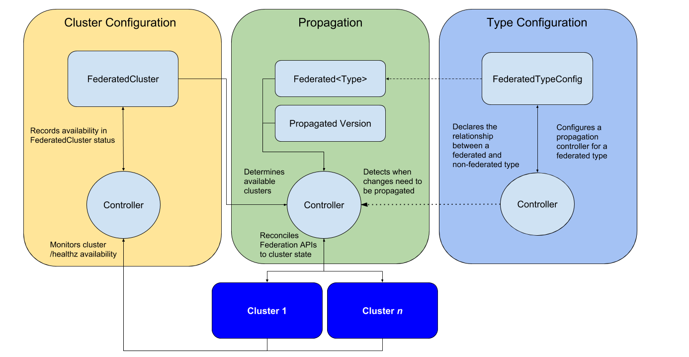

## Kubernetes Federation v2

This repo contains an in-progress prototype of some of the
foundational aspects of V2 of Kubernetes Federation.  The prototype
builds on the sync controller (a.k.a. push reconciler) from
[Federation v1](https://github.com/kubernetes/federation/) to iterate
on the API concepts laid down in the [brainstorming
doc](https://docs.google.com/document/d/159cQGlfgXo6O4WxXyWzjZiPoIuiHVl933B43xhmqPEE/edit#)
and further refined in the [architecture
doc](https://docs.google.com/document/d/1ihWETo-zE8U_QNuzw5ECxOWX0Df_2BVfO3lC4OesKRQ/edit#).
Access to both documents is available to members of the
[kubernetes-sig-multicluster google
group](https://groups.google.com/forum/#!forum/kubernetes-sig-multicluster).

<p align="center"></p>

## Concepts

The following abstractions support the propagation of a logical
federated type:

- Template: defines the representation of the resource common across clusters
- Placement: defines which clusters the resource is intended to appear in
- Override: optionally defines per-cluster field-level variation to apply to the template

These 3 abstractions provide a concise representation of a resource
intended to appear in multiple clusters.  Since the details encoded by
the abstractions are the minimum required for propagation, they are
well-suited to serve as the glue between any given propagation
mechanism and higher-order behaviors like policy-based placement and
dynamic scheduling.

## Getting started

### Required: `apiserver-builder`
This repo depends on
[apiserver-builder](https://github.com/kubernetes-incubator/apiserver-builder)
to generate code and build binaries.  Download a [recent
release](https://github.com/kubernetes-incubator/apiserver-builder/releases)
and install it in your `PATH`.

### Adding a new API type

As per the
[docs](https://github.com/kubernetes-incubator/apiserver-builder/blob/master/docs/tools_user_guide.md#create-an-api-resource)
for apiserver-builder, bootstrapping a new federation v2 API type can be
accomplished as follows:

```
# Bootstrap and commit a new type
$ apiserver-boot create group version resource --group federation --version v1alpha1 --kind <your-kind>
$ git add .
$ git commit -m 'Bootstrapped a new api resource federation.k8s.io./v1alpha1/<your-kind>'

# Modify and commit the bootstrapped type
$ vi pkg/apis/federation/v1alpha1/<your-kind>_types.go
$ git commit -a -m 'Added fields to <your-kind>'

# Update the generated code and commit
$ apiserver-boot build generated
$ git add .
$ git commit -m 'Updated generated code'
```

The generated code will need to be updated whenever the code for a
type is modified. Care should be taken to separate generated from
non-generated code in the commit history.

### Enabling federation of a type

Implementing support for federation of a Kubernetes type requires
the following steps:

 - add a new template type (as per the [instructions](#adding-a-new-type) for adding a new type)
   - Ensure the spec of the new type has a `Template` field of the target Kubernetes type.
   - e.g. [FederatedSecret](https://github.com/marun/federation-v2/blob/master/pkg/apis/federation/v1alpha1/federatedsecret_types.go#L49)

 - add a new placement type
   - Ensure the spec of the new type has the `ClusterNames` field of type `[]string`
   - e.g. [FederatedSecretPlacement](https://github.com/marun/federation-v2/blob/master/pkg/apis/federation/v1alpha1/federatedsecretplacement_types.go)

 - (optionally) add a new override type
   - Ensure the new type contains fields that should be overridable
   - e.g. [FederatedSecretOverride](https://github.com/marun/federation-v2/blob/master/pkg/apis/federation/v1alpha1/federatedsecretoverride_types.go)

 - Add a new propagation adapter
   - the [push
     reconciler](https://github.com/marun/federation-v2/blob/master/pkg/controller/sync/controller.go)
     targets an [adapter
     interface](https://github.com/marun/federation-v2/blob/master/pkg/federatedtypes/adapter.go),
     and any logical federated type implementing the interface can be
     propagated by the reconciler to member clusters.
   - e.g. [FederatedSecretAdapter](https://github.com/marun/federation-v2/blob/master/pkg/federatedtypes/secret.go)

### Testing

#### Integration

The integration tests will spin up a federation consisting of kube
api + cluster registry api + federation api + 2 member clusters and
run [CRUD (create-read-update-delete)
checks](https://github.com/marun/federation-v2/blob/master/test/integration/crud_test.go)
for federated types against that federation.  To run:

 - ensure binaries for `etcd`, `kube-apiserver` and `clusterregistry` are in the path
   - https://github.com/coreos/etcd/releases
   - https://storage.googleapis.com/kubernetes-release/release/v1.9.6/bin/linux/amd64/kube-apiserver
   - https://github.com/kubernetes/cluster-registry/releases
 - `cd test/integration && go test -i && go test -v`

To run tests for a single type:

``
cd test/integration && go test -i && go test -v -run ^TestCrud/FederatedSecret$
``

It may be helpful to use the [delve
debugger](https://github.com/derekparker/delve) to gain insight into
the components involved in the test:

``
cd test/integration && dlv test -- -test.run ^TestCrud$
``

### Code of Conduct

Participation in the Kubernetes community is governed by the
[Kubernetes Code of Conduct](./code-of-conduct.md).
