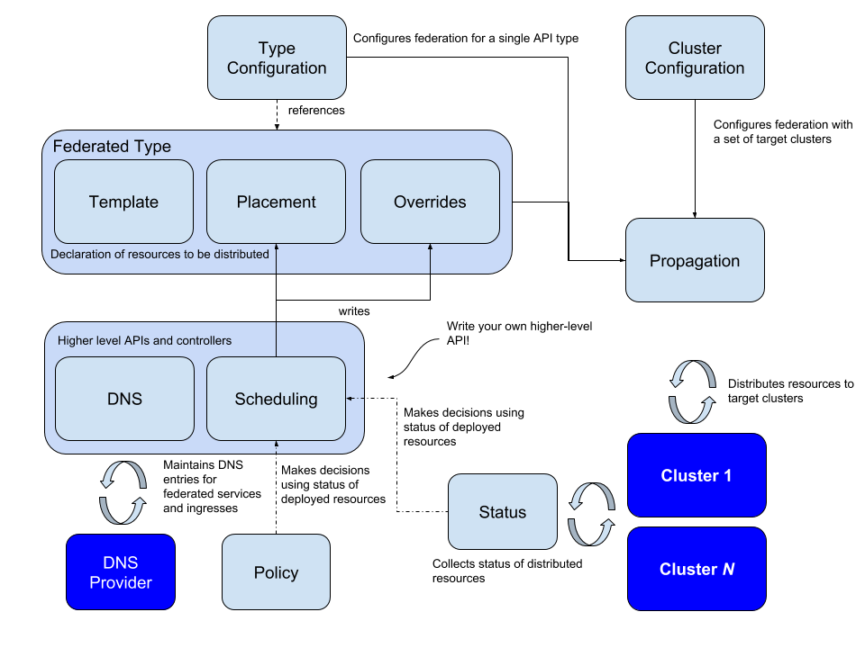

[](https://github.com/kubernetes-sigs/kubefed/actions?query=branch%3Amaster "Github Actions")
[](https://goreportcard.com/report/github.com/kubernetes-sigs/kubefed)
[](https://quay.io/repository/kubernetes-multicluster/kubefed)
[](https://github.com/kubernetes-sigs/kubefed/blob/master/LICENSE)
[](https://github.com/kubernetes-sigs/kubefed/releases "KubeFed latest release")

# Kubernetes Cluster Federation

Kubernetes Cluster Federation (KubeFed for short) allows you to coordinate the
configuration of multiple Kubernetes clusters from a single set of APIs in a
hosting cluster. KubeFed aims to provide mechanisms for expressing which
clusters should have their configuration managed and what that configuration
should be. The mechanisms that KubeFed provides are intentionally low-level, and
intended to be foundational for more complex multicluster use cases such as
deploying multi-geo applications and disaster recovery.

KubeFed is currently **beta**.

## Concepts

<p align="center"></p>

KubeFed is configured with two types of information:

- **Type configuration** declares which API types KubeFed should handle
- **Cluster configuration** declares which clusters KubeFed should target

**Propagation** refers to the mechanism that distributes resources to federated
clusters.

Type configuration has three fundamental concepts:

- **Templates** define the representation of a resource common across clusters
- **Placement** defines which clusters the resource is intended to appear in
- **Overrides** define per-cluster field-level variation to apply to the template

These three abstractions provide a concise representation of a resource intended
to appear in multiple clusters. They encode the minimum information required for
**propagation** and are well-suited to serve as the glue between any given
propagation mechanism and higher-order behaviors like policy-based placement and
dynamic scheduling.

These fundamental concepts provide building blocks that can be used by
higher-level APIs:

- **Status** collects the status of resources distributed by KubeFed across all federated clusters
- **Policy** determines which subset of clusters a resource is allowed to be distributed to
- **Scheduling** refers to a decision-making capability that can decide how
  workloads should be spread across different clusters similar to how a human
  operator would

## Features

| Feature | Maturity | Feature Gate | Default |
|---------|----------|--------------|---------|
| [Push propagation of arbitrary types to remote clusters](https://github.com/kubernetes-sigs/kubefed/blob/master/docs/userguide.md#verify-your-deployment-is-working) | Alpha | PushReconciler | true |
| [CLI utility (`kubefedctl`)](https://github.com/kubernetes-sigs/kubefed/blob/master/docs/userguide.md#kubefedctl-cli) | Alpha | | |
| [Generate KubeFed APIs without writing code](https://github.com/kubernetes-sigs/kubefed/blob/master/docs/userguide.md#enabling-federation-of-an-api-type) | Alpha | | |
| [Replica Scheduling Preferences](https://github.com/kubernetes-sigs/kubefed/blob/master/docs/userguide.md#replicaschedulingpreference) | Alpha | SchedulerPreferences | true |

## Guides

### Quickstart

1. Clone this repo:
   ```
   git clone https://github.com/kubernetes-sigs/kubefed.git
   ```
1. Start a [kind](https://kind.sigs.k8s.io/) cluster:
   ```
   kind create cluster
   ```
1. Deploy kubefed:
   ```
   make deploy.kind
   ```

You now have a Kubernetes cluster with kubefed up and running. The cluster has been joined to itself and you can test federation of resources like this:

1. Verify the `KubeFedCluster` exists and is ready:
   ```
   kubectl -n kube-federation-system get kubefedcluster
   ```
   **If you're on macOS** the cluster will not immediately show as ready. You need to [change the API endpoint's URL first](https://github.com/kubernetes-sigs/kubefed/blob/master/docs/cluster-registration.md#joining-kind-clusters-on-macos):
   ```
   ./scripts/fix-joined-kind-clusters.sh
   ```
1. Create a namespace to be federated:
   ```
   kubectl create ns federate-me
   ```
1. Tell kubefed to federate that namespace (and the resources in it):
   ```
   ./bin/kubefedctl federate ns federate-me
   ```
1. Create a `ConfigMap` to be federated:
   ```
   kubectl -n federate-me create cm my-cm
   ```
1. Tell kubefed to federate that `ConfigMap`:
   ```
   ./bin/kubefedctl -n federate-me federate configmap my-cm
   ```
1. Verify the `FederatedConfigMap` has been created and propagates properly:
   ```
   kubectl -n federate-me describe federatedconfigmap my-cm
   ```

### User Guide

Take a look at our [user guide](docs/userguide.md) if you are interested in
using KubeFed.

### Development Guide

Take a look at our [development guide](docs/development.md) if you are
interested in contributing.

## Community

Refer to the [contributing guidelines](./CONTRIBUTING.md) if you would like to contribute to KubeFed.

### Communication channels

KubeFed is sponsored by [SIG Multicluster](https://github.com/kubernetes/community/tree/master/sig-multicluster) and it uses the same communication channels as SIG multicluster.

* Slack channel: [#sig-multicluster](http://slack.k8s.io/#sig-multicluster)
* [Mailing list](https://groups.google.com/forum/#!forum/kubernetes-sig-multicluster)

## Code of Conduct

Participation in the Kubernetes community is governed by the
[Kubernetes Code of Conduct](./code-of-conduct.md).
