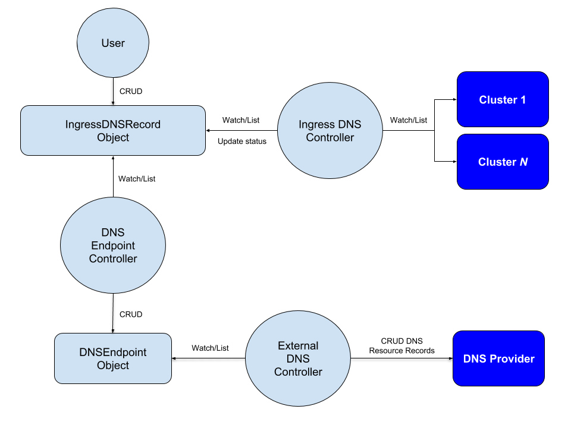

<!-- START doctoc generated TOC please keep comment here to allow auto update -->
<!-- DON'T EDIT THIS SECTION, INSTEAD RE-RUN doctoc TO UPDATE -->
**Table of Contents**  *generated with [DocToc](https://github.com/thlorenz/doctoc)*

- [Multi-Cluster Ingress DNS with ExternalDNS Guide](#multi-cluster-ingress-dns-with-externaldns-guide)
  - [Concepts](#concepts)
  - [User Guide](#user-guide)

<!-- END doctoc generated TOC please keep comment here to allow auto update -->

# Multi-Cluster Ingress DNS with ExternalDNS Guide

Multi-Cluster Ingress DNS (MCIDNS) provides the ability to programmatically manage DNS records of Kubernetes Ingress
resources. MCIDNS is not meant to replace in-cluster DNS providers such as [CoreDNS](https://coredns.io/). Instead, MCIDNS
integrates with [ExternalDNS](https://github.com/kubernetes-incubator/external-dns) through
[CRD Source](https://github.com/kubernetes-incubator/external-dns/blob/master/docs/contributing/crd-source.md) to manage
external DNS records of Ingress resources in supported DNS providers.

## Concepts

<p align="center"></p>

The above diagram illustrates MCIDNS. A typical MCIDNS workflow consists of:

1. Creating `FederatedDeployment`, `FederatedService`, and `FederatedIngress` resources. The KubeFed sync
   controller propagates the corresponding `Deployment`, `Service`, and `Ingress` resources to target clusters.
2. Creating an `IngressDNSRecord` resource that identifies the intended domain name(s) and optional DNS resource
   record parameters.

MCIDNS is comprised of multiple types and controllers:

- The Ingress DNS Controller watches for `IngressDNSRecord` resources and updates the status of the resource with the IP
  address of matching (matching here means the resource with the same name and namespace) target `Ingress` resource(s).
- The DNS Endpoint Controller watches for `IngressDNSRecord` resources and creates an associated `DNSEndpoint`
  resource. `DNSEndpoint` contains the necessary information to create an external DNS record. An external DNS system
  (i.e. [ExternalDNS](https://github.com/kubernetes-incubator/external-dns)) is responsible for watching `DNSEndpoint`
  resources and using the endpoint information to create the DNS resource record in the DNS provider.

## User Guide

Setting-up MCIDNS can be accomplished by referencing the following documentation:

- The KubeFed [User Guide](userguide.md) to setup one or more Kubernetes clusters and the KubeFed
  control-plane. If running in GKE, the cluster hosting the ExternalDNS controller must have scope
  `https://www.googleapis.com/auth/ndev.clouddns.readwrite`.
- If needed, create a domain name with one of the supported providers or delegate a DNS subdomain for use with
  ExternalDNS. Reference your DNS provider documentation on how to create a domain or delegate a subdomain.
- The [ExternalDNS](https://github.com/kubernetes-incubator/external-dns) user guides to run the external-dns
  controller. You must ensure the following `args` are provided in the external-dns Deployment manifest:
  `--source=crd --crd-source-apiversion=multiclusterdns.kubefed.io/v1alpha1 --crd-source-kind=DNSEndpoint --registry=txt --txt-prefix=cname`
  **Note**: If you do not deploy the external-dns controller to the same namespace and use the default service account
  of the KubeFed control-plane, you must setup RBAC permissions allowing the controller access to necessary
  resources.

After the cluster, KubeFed control-plane, and external-dns controller are running, use the
[sample](../example/sample1) federated deployment, service, and ingress to test MCIDNS. Check the status of all the
resources in each cluster by running:

```bash
$ for r in deployment service ingress; do
    for c in cluster1 cluster2; do
        echo; echo ------------ ${c} resource: ${r} ------------; echo
        kubectl --context=${c} get ${r} -n test-namespace
        echo; echo
    done
done
```

It may take a few minutes for the `ADDRESS` field of each `Ingress` to be populated. Next, create the
`IngressDNSRecord`. **Note:** The `hosts` field value(s) should match the associated `host` field value(s) in the associated
`FederatedIngress` resource.

```bash
$ cat <<EOF | kubectl create -f -
apiVersion: multiclusterdns.kubefed.io/v1alpha1
kind: IngressDNSRecord
metadata:
  name: test-ingress
  namespace: test-namespace
spec:
  hosts:
  - ingress.example.com
  recordTTL: 300
EOF
```

After creating the `IngressDNSRecord`, the DNS Endpoint controller uses the IP address from each target `Ingress` to
populate the `targets` field of the `DNSEndpoint` resource. For example:

```bash
$ kubectl -n test-namespace get dnsendpoints -o yaml
apiVersion: v1
items:
- apiVersion: multiclusterdns.kubefed.io/v1alpha1
  kind: DNSEndpoint
  metadata:
    creationTimestamp: 2018-10-10T20:37:38Z
    generation: 1
    name: ingress-test-ingress
    namespace: test-namespace
    resourceVersion: "251874"
    selfLink: /apis/multiclusterdns.kubefed.io/v1alpha1/namespaces/test-namespace/dnsendpoints/ingress-test-ingress
    uid: 538d1063-cccc-11e8-bebb-42010a8a00b8
  spec:
    endpoints:
    - dnsName: ingress.example.com
      recordTTL: 300
      recordType: A
      targets:
      - $CLUSTER1_INGRESS_IP
      - $CLUSTER2_INGRESS_IP
  status: {}
kind: List
metadata:
  resourceVersion: ""
  selfLink: ""
```

The ExternalDNS controller is watching `DNSEndpoint` resources and creates `A` and `TXT` records in the configured DNS
provider for each target `Ingress`. Here is an example for the Google Cloud DNS provider using a zone named
"example-com".

```bash
$ gcloud dns record-sets list --zone="example-com"
NAME                  TYPE  TTL    DATA
example.com.          NS    21600  ns-cloud-b1.googledomains.com.,ns-cloud-b2.googledomains.com.,ns-cloud-b3.googledomains.com.,ns-cloud-b4.googledomains.com.
example.com.          SOA   21600  ns-cloud-b1.googledomains.com. cloud-dns-hostmaster.google.com. 6 21600 3600 259200 300
ingress.example.com.  A     300    $CLUSTER1_INGRESS_IP,$CLUSTER2_INGRESS_IP
ingress.example.com.  TXT   300    "heritage=external-dns,external-dns/owner=my-identifier"
```

Check that name resolution works. Keep in mind that propagating DNS names from authoritative name servers to
resolvers takes time. In this example, `dig` is used with authoritative name server
`ns-cloud-b1.googledomains.com`:

```bash
$ dig +short @ns-cloud-b1.googledomains.com. ingress.example.com
$CLUSTER1_INGRESS_IP
$CLUSTER2_INGRESS_IP
```
