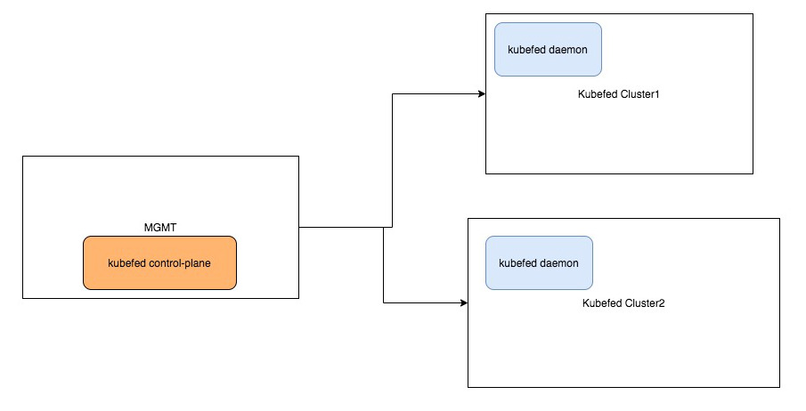
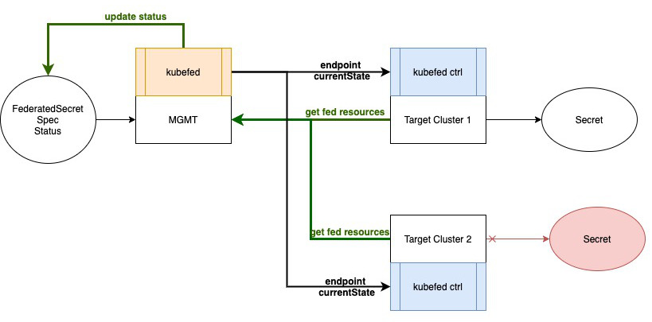
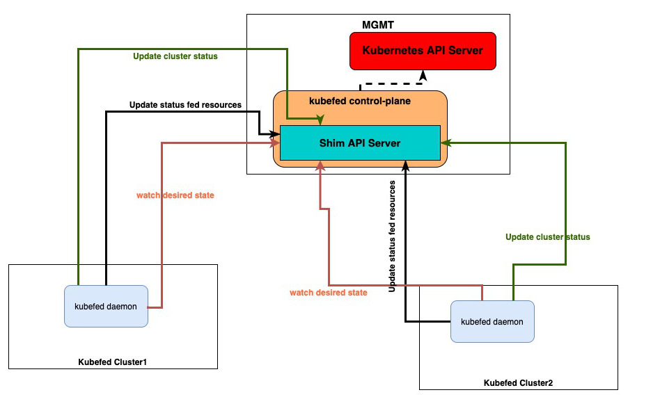

# Kubefed v2 -- Architectural changes

## Table of Contents

<!-- toc -->
- [Summary](#summary)
- [Motivation](#motivation)
  - [Goals](#goals)
  - [Non-Goals](#non-goals)
- [Proposal](#proposal)
  - [Kubefed Daemon](#kubefed-daemon)
  - [Kubefed Control-Plane](#kubefed-control-plane)
  - [Controller Resource Propagation Status](#controller-resource-propagation-status)
  - [Kubefed Security Concerns](#kubefed-security-concerns)
- [Alternatives](#alternatives)
<!-- /toc -->

## Summary

Design the new kubefed architecture to provide an alternative resource propagation model
that would eventually improve the scalability and performance of kubefed at scale.
Additionally, this new model aims to satisfy other infrastructure configurations where the control-plane
cluster cannot reach the kubefed clusters.

## Motivation

Nowadays, all kubefed resource propagation logic is computed in the control-plane, that can become a bottleneck
whenever the amount of clusters and/or federated resources increases.
Scalability is important but also performance to avoid high response times when
managing the lifecycle of certain federated resources.
The community has shared their desire to have an alternative resource propagation model
than the current `push-reconciler` mechanism.
This could solve situations where the customers might have an infrastructure setup
where the kubefed clusters are behind some NAT gateways.
Additionally, customers also prefer to avoid giving write permissions of their clusters to
store them in the control-plane cluster.

The motivation is to provide two propagation models: `push` (keeping the support of the current model) and `pull`.
Users would be able to choose the desired propagation logic for their setup.

### Goals

* Design a pull-based reconciliation.
* Scale kubefed to manage thousands of resources without major penalties.
* Design a new architecture that could easily be extended to add new functionalities in the future.
* Promote towards a decentralized propagation and reconciliation model.
* The new pull reconciliation model won't change where the federated resource definition lives. All the logic would remain
in the kubefed control plane cluster, as until now.
* Define an upgrade path from a push to a pull model, and thereby facilitate the adoption of this new model on running clusters.
* Make usage of the server-side apply approach as a way to simplify the update logic of the new controllers used in the kubefed daemons.

## Non Goals

* Migrate all the controllers to use the controller-runtime. This intention exists
but is not the ultimate goal during this refactoring.
* Improve the status property of federated resources to reflect the current state of
the resources and not the propagation status only.

## Proposal

This approach splits the current kubefed architecture into two parts: agents (aka kubefed daemons) and a control-plane.
It aims to decentralize the propagation and reconciliation towards the daemons.

Users can choose the propagation and reconciliation model via a feature gate.
With that, this approach provides backwards compatibility with the existing push model while enabling the users to choose this new model.

In this pull-reconciler approach, we could highlight certain aspects that change in comparison with the pull-reconciler:

* The kubefed agents are daemons running in the registered/joined kubefed clusters.
* The control-plane logic changes to use a pull-based reconciliation and to rely on
the kubefed daemons running on the target clusters handling most of the computation.
* The management of federated resources remains in the cluster where the control-plane is deployed.
The control-plane still handles the create, update, deletion of federated resources.

The kubefed daemons are responsible of reconciling the cluster to the desired state
and updating the status of the federated resources.

This proposal is divided into two iterations in order to provide an experimental version of this new model as soon as possible:

1) Initially, kubefed daemons have no restrictions to `watch`, `list` any federated resources and `write` the status of any federated resource.
   Any daemon can view which resources are scheduled on any kubefed cluster, even if these federated resources are not placed in
   its own cluster.
   Kubefed daemons have to update the status of the kubefed cluster resources.
   A periodically operation updates the health status of each kubefed cluster.

2) The second iteration adds a shim API server to the kubefed control-plane components that sits between the Kubernetes API server and kubefed daemons.
This solution provides a security middleware to control which resources can be viewed and accessed by each kubefed daemon.
Additionally, this new daemon (the shim API server) increases the scalability of the control plane by reducing each daemon's impact on the Kubernetes API server.
It watches events from the federated resources and does a fan-out to the kubefed daemon's.

### Kubefed Daemon

On each registered kubefed cluster, a daemon should be deployed to watch the state
of the cluster and federated resources. Likewise this daemon should periodically
reconcile the desired state to create/delete/update the federated resources.

As done in the past, the `kubefedctl join` command creates a kubefed cluster in
the control-plane cluster, and now deploys the kubefed daemon in the target cluster.
This operation also exchanges the required permissions (tokens, kubeconfigs) and url to enable
the communication between the daemons and the control-plane.

The installation of the kubefed daemon depends on whether there is access from the control-plane cluster
to the kubefed cluster:

* If the control-plane cluster can access the kubefed cluster, the deployment could be easily done by consuming the
kubefed cluster's kubeconfig file when running the `kubefedctl join` command.

* A manual deployment where the operator create the required Kubernetes resources to deploy the daemons.

In both solutions, the kubefed daemon registers itself using a token, analogously to how it happens today with the bootstrapping of kubelets.

In the following we explain how this uni-directional communication occurs:

* `kubefed daemon --> control-plane`: the daemon needs to reconcile with the control-plane
to be synced with the federated resources to create/update/delete.
This is crucial to keep the kubefed clusters in sync with the desired state defined in the control-plane.
Likewise, the kubefed daemon periodically updates the status of the federated resources and cluster
status on the control-plane cluster.

#### Collect the Cluster and Resource Status

The daemon is in charge of updating the status of the federated resources in the control plane cluster.
Likewise it has to update the status of the kubefed cluster to report its status as `ClusterOffline`, `ClusterReady`.
The update follows a heartbeat mechanism analogously to the kubelet-apiserver model where the control-plane sets
as `ClusterNotReady` whenever a kubefed daemon skips a heartbeat.

As mentioned above, the kubefed daemons have to periodically collect the status of the federated resources in each
cluster.

The resources can be filtered by the label `kubefed.io/managed=true` to exclude them from the rest of Kubernetes resources.
In addition to that, the kubefed daemon periodically checks the type of the federated
resources and create an `Informer` per `FederatedTypeConfig`.
The list of `FederatedTypeConfig` available resources is defined in the control-plane cluster.
There is no need to create an `Informer` per kind of resource type in the kubefed cluster.
The `Informer` populates the cache with the status of the federated resources.
The daemon then updates the status of the federated resources in the control-plane cluster,
so the control-plane has to grant update permissions to modify the status of a federated resource for a cluster.

In order to know the `TargetType` of the federated resources, the control-plane grants access to daemons
to `watch` and `get` the list of federated types.

#### Desired State Reconciliation

Every daemon is responsible of keeping on sync which federated resources need to be created/updated/deleted
in its managed cluster.

To do so, the kubefed talks to the control-plane to be informed of which resources
need to be federated in the cluster.
Every kubefed daemon has to create a remote informer to watch any changes in the federated
types which all belong to the same group `types.kubefed.io`.
This remote informer is created against the control-plane cluster, so a kubeconfig
and the required permissions should be granted to all the kubefed clusters.
A controller uses that `Informer` and trigger the respective operations to reach the
desired state of the kubefed cluster.
This operation might change when building the **second iteration** where the daemon interacts with the shim API server
which watches the list of resources per cluster.

Likewise this reconciliation loop is in charge of reverting any local changes done in a kubefed cluster to
a federated resource.
This ensures that the desired state defined in the control-plane cluster is enforced
in the target clusters.

### Kubefed control-plane

The control-plane exposes a feature gate to choose a reconciliation model: `pull` or `push`.

Analogously to the `push` model, the definition of federated resources is done in the control-plane cluster.

Keeping the desired state synced with the state of the clusters would define the success of this new architecture.

#### First iteration

As part of the **first iteration**, each daemon gets a service account to talk to the Kubernetes API of the control-plane cluster.
This service account defines the appropriated set of RBAC rules to `watch`, `list` and `write` the status of the federated resources for a kubefed cluster.
The creation of this account and the respective RBAC rules takes place whenever a kubefed cluster successfully joins the federation.
A controller would keep up-to-date each account with the respective RBAC rules to match the available
federated types at any time for each kubefed cluster.
This limits which operations a kubefed cluster can do over other resource types in the control-plane cluster.

This first iteration provides a decentralized reconciliation and propagation where the daemons directly talk to
the Kubernetes API server to ensure the desired state.

However this iteration does not filter which federated resources can be viewed or accessed by each kubefed cluster. This would be addressed as
part of the second iteration.

#### Second iteration

During the **second iteration**, the kubefed control-plane deploys an additional component.
This component works as a shim API server to which the kubefed daemons talk to perform
all the operations done via the Kubernetes API server in the **first iteration**.
The shim API server limits what each daemon can view or access and reduces the load of the daemons on the Kubernetes API server.

The main challenge of this shim API server is filtering which federated resources a kubefed
daemon should be able to `get`, `watch`, `list` and `update` their status.

This server watches for changes in the federated resources, and does a fan-out to it's daemons.
This also reduces the load on the Kubernetes API server significantly cause kubefed daemons are talking to this server.
All the kubefed daemon operations on federated resources are handled by the shim API server that works **similarly** to an authorizers and an aggregated API combined.
A daemon should be only aware of changes in the resources assigned to its own cluster.

Without this new control-plane component, every kubefed daemon would have to perform any operations and register its own watch via the Kubernetes API Server.
Consequently the load on API server would multiply as you scale up the number of kubefed daemons, and the system would lack of a proper secure layer to limit what each daemon can access or do.

By having this API server, all the watch events are off-loaded to this component which filters the visibility of resources from the Kubernetes API server.

#### Other Main Reconciliation Loops

As part of this new reconciliation pull mode, there are certain controllers that
could become deprecated or removed.

For the `ServiceDNSRecord` controller, Kubefed `v2` should omit this functionality and rely on
other solutions such as service meshes.
The purpose of Kubefed should be to ultimately federate resources across clusters.
Another option is to expose an additional endpoint in the daemons to be aware of the
`serviceDNS`, therefore the control-plane does not need to create remote `Informer` against
all the kubefed clusters.

The future of `ServiceDNSRecord` controller is something to decide with the community.
It goes one step beyond by dealing with networking considerations when talking to apps deployed across clusters.

On the other hand, the controllers in charge of the scheduler preferences remains as part of the control-plane.
The enforcement of these preferences rely on the control-plane and daemons, so nothing would change there.

The rest of kubefed cluster related operations would be managed by controllers in the control-plane.

### Kubefed Security Concerns

As detailed above, the **first iteration** is more naive allowing all the daemons to
view and access all federated resources independently of the placement constraints.
Thus a kubefed daemon could view and update the status of federated resources whose placement
constraints are not assigned to the daemon's cluster.

With the **second iteration**, the system transitions to a different model where
the shim API server filters which resources and what operations a daemon can perform over a federated resource.
The system consumes the placement properties to identify what a daemons can watch, get, list
and update the status of a specific federated resource.

### User Stories

#### Story 1

Users want to avoid giving cluster admin access to something like federation,
some admins have expressed distaste at that requirement.
If the management cluster is compromised that would give access to the kubefed clusters.

With this new proposal, the management cluster only has read access to the kubefed clusters.

#### Story 2

Kubefed uses push reconciliation, all the workload relies on the control plane running
on the management cluster. Due to the existing design decisions, kubefed represents
a bottleneck when having to manage thousands of resources across many clusters.

With this new proposal, Kubefed would use a pull-based reconciliation mechanism
and most of the workload is shared between the kubefed agents and the control-plane.

#### Story 3

Customers might have an infrastructure setup where the kubefed clusters are behind
some NAT gateways, and consequently the control-plane cannot reach the kubefed clusters.

With this new approach, the kubefed daemon can register with the control plane and sets up
a bi-directional tunnel.

## Alternatives

### Centralized Resource Management -- GitOps

In order to avoid the `kubefed daemon --> control-plane` communication, I thought
about using a centralized component where the federated resources could be created
to be consumed by all the kubefed clusters.

This centralized component represents a hybrid approach of using the federation api to define configuration, and then generating a canonical form into a git repository for gitOps.
This alternative solution might represent a good solution for some use cases.

#### Analysis

As an administrator, the admins prefer to have the RBAC rules in the cluster,
and not outsourced to a git repository with rules about who gets to push what where.

With this alternative, the communication flow goes against the gitOps repository or
centralized datastore where the desired state is stored.

This alternative adds a new third party in the game which might increase the complexity of the whole architecture.

In terms of security, the system should rely on what each cluster is allowed to view,
likewise it is hard to understand how `overwrites` would work in a per cluster level.
