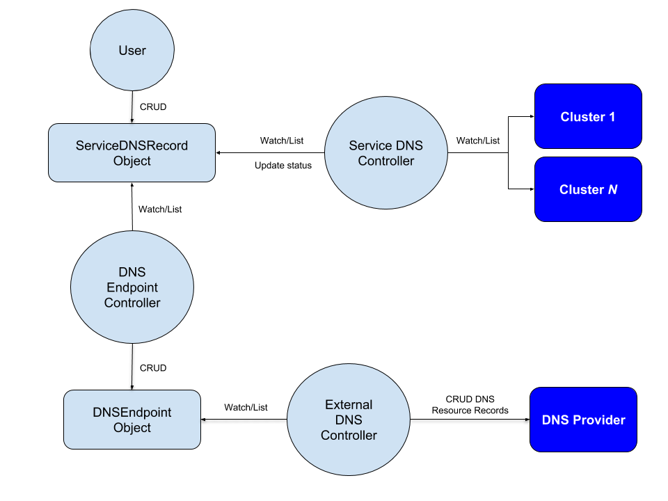

<!-- START doctoc generated TOC please keep comment here to allow auto update -->
<!-- DON'T EDIT THIS SECTION, INSTEAD RE-RUN doctoc TO UPDATE -->
**Table of Contents**  *generated with [DocToc](https://github.com/thlorenz/doctoc)*

- [Multi-Cluster Service DNS with ExternalDNS Guide](#multi-cluster-service-dns-with-externaldns-guide)
  - [Concepts](#concepts)
  - [User Guide](#user-guide)

<!-- END doctoc generated TOC please keep comment here to allow auto update -->

# Multi-Cluster Service DNS with ExternalDNS Guide

Multi-Cluster Service DNS (MCSDNS) provides the ability to programmatically manage DNS resource records of Kubernetes
`Service` objects. MCSDNS is not meant to replace in-cluster DNS providers such as [CoreDNS](https://coredns.io/).
Instead, MCSDNS integrates with [ExternalDNS](https://github.com/kubernetes-incubator/external-dns) through
[CRD Source](https://github.com/kubernetes-incubator/external-dns/blob/master/docs/contributing/crd-source.md) to manage
DNS resource records of Kubernetes Service object for supported DNS providers.

## Concepts

<p align="center"></p>

The above diagram illustrates MCSDNS. A typical MCSDNS workflow consists of:

1. Creating `FederatedDeployment` and `FederatedService` objects. The KubeFed sync
   controller propagates the corresponding objects to target clusters.
2. Creating a `Domain` object that associates a DNS zone and authoritative name server for the KubeFed control plane.
3. Creating a `ServiceDNSRecord` object that identifies the intended domain name and other optional resource
   record details of a `Service` object that exists in one or more target clusters.
4. A `DNSEndpoint` object created by the DNS Endpoint Controller that corresponds to the `ServiceDNSRecord`. The
   `DNSEndpoint` object contains 3 `endpoints` of `recordType: A`, each representing a DNS resource record with the
   following scheme:
   `<service>.<namespace>.<federation>.svc.<federation-domain> <service>.<namespace>.<federation>.svc.<region>.<federation-domain> <service>.<namespace>.<federation>.svc.<availability-zone>.<region>.<federation-domain>`
5. An external DNS system (i.e. ExternalDNS) watches and lists `DNSEndpoint` objects and creates DNS resource records
   in supported DNS providers based on the desired state of the object.

MCSDNS is comprised of multiple types and controllers:

- The Service DNS Controller will watch and list `ServiceDNSRecord` objects and update the status of the object with the
  corresponding target `Service` load-balancer IP address.
- The DNS Endpoint Controller watches and lists the `ServiceDNSRecord` object and creates a corresponding `DNSEndpoint`
  object containing the necessary details (i.e. name, TTL, IP) to create a DNS resource record by an external DNS system.
  An external DNS system (i.e. [ExternalDNS](https://github.com/kubernetes-incubator/external-dns)) is responsible for
  watching `DNSEndpoint` objects and using the endpoint information to create DNS resources records in supported DNS
  providers.

## User Guide

Setting-up MCSDNS can be accomplished by referencing the following documentation:

- The KubeFed [User Guide](userguide.md) to setup one or more Kubernetes clusters and the KubeFed
  control-plane. Due to [Issue #370](https://github.com/kubernetes-sigs/kubefed/issues/370), the environment running
  the clusters must support service `type: LoadBalancer`. For the GKE deployment option, the cluster hosting the ExternalDNS controller must have scope
  `https://www.googleapis.com/auth/ndev.clouddns.readwrite`.
- If needed, create a domain name with one of the supported providers or delegate a DNS subdomain for use with
  ExternalDNS. Reference your DNS provider documentation on how to create a domain or delegate a subdomain.
- The [ExternalDNS](https://github.com/kubernetes-incubator/external-dns) user guides to run the external-dns
  controller. You must ensure the following `args` are provided in the external-dns Deployment manifest:
  `--source=crd --crd-source-apiversion=multiclusterdns.kubefed.io/v1alpha1 --crd-source-kind=DNSEndpoint --registry=txt --txt-prefix=cname`
  **Note**: If you do not deploy the external-dns controller to the same namespace and use the default service account
  of the KubeFed control-plane, you must setup RBAC permissions allowing the controller access to necessary
  resources.

After the cluster, KubeFed control-plane, and external-dns controller are running, use the
[sample](../example/sample1) federated deployment and service to test MCSDNS. You must change the sample service type to
`LoadBalancer` for the Service DNS controller to populate the status IP of the `ServiceDNSRecord` and the target IP's of
the `DNSEndpoint`:

```bash
sed -i 's/NodePort/LoadBalancer/' example/sample1/federatedservice.yaml
```

You can now create the sample deployment and service using `kubectl`. Then check the status of all the resources in each
cluster before proceeding:

```bash
$ for r in deployment service; do
    for c in cluster1 cluster2; do
        echo; echo ------------ ${c} resource: ${r} ------------; echo
        kubectl --context=${c} get ${r}
        echo; echo
    done
done
```

It may take a few minutes for the `EXTERNAL-IP` field of each `Service` to be populated. Next, create the
`Domain` and `ServiceDNSRecord`:

```bash
$ cat <<EOF | kubectl create -f -
apiVersion: multiclusterdns.kubefed.io/v1alpha1
kind: Domain
metadata:
  # Corresponds to <federation> in the resource records.
  name: test-domain
  # The namespace running kubefed-controller-manager.
  namespace: kube-federation-system
# The domain/subdomain that is setup in your external-dns provider.
domain: your.domain.name
---
apiVersion: multiclusterdns.kubefed.io/v1alpha1
kind: ServiceDNSRecord
metadata:
  # The name of the sample service.
  name: test-service
  # The namespace of the sample deployment/service.
  namespace: test-namespace
spec:
  # The name of the corresponding `Domain`.
  domainRef: test-domain
  recordTTL: 300
EOF
```

The DNS Endpoint controller will use the external IP address from each `Service` to populate the `targets` field of the
`DNSEndpoint` object. For example:

```bash
$ kubectl -n test-namespace get dnsendpoint -o yaml
apiVersion: multiclusterdns.kubefed.io/v1alpha1
kind: DNSEndpoint
metadata:
  creationTimestamp: 2018-10-12T21:41:12Z
  generation: 1
  name: service-test-service
  namespace: test-namespace
  resourceVersion: "755496"
  selfLink: /apis/multiclusterdns.kubefed.io/v1alpha1/namespaces/test-namespace/dnsendpoints/service-test-service
  uid: 89c18705-ce67-11e8-bebb-42010a8a00b8
spec:
  endpoints:
  - dnsName: test-service.test-namespace.test-domain.svc.your.domain.name
    recordTTL: 300
    recordType: A
    targets:
    - $CLUSTER1_SERVICE_IP
    - $CLUSTER2_SERVICE_IP
  - dnsName: test-service.test-namespace.test-domain.svc.us-west1-b.us-west1.your.domain.name
    recordTTL: 300
    recordType: A
    targets:
    - $CLUSTER1_SERVICE_IP
    - $CLUSTER2_SERVICE_IP
  - dnsName: test-service.test-namespace.test-domain.svc.us-west1.your.domain.name
    recordTTL: 300
    recordType: A
    targets:
    - $CLUSTER1_SERVICE_IP
    - $CLUSTER2_SERVICE_IP
status: {}
```

The ExternalDNS controller is watching for `DNSEndpoint` objects and creates 3 `A` and 3 `TXT` resource records for
each `DNSEndpoint` in the configured DNS provider. The following example lists resource records for zone
"your-domain-name" in Google Cloud DNS.

```bash
$ gcloud dns record-sets list --zone="your-domain-name"
NAME                                                                               TYPE  TTL    DATA
your.domain.name.                                                                  NS    21600  ns-cloud-b1.googledomains.com.,ns-cloud-b2.googledomains.com.,ns-cloud-b3.googledomains.com.,ns-cloud-b4.googledomains.com.
your.domain.name.                                                                  SOA   21600  ns-cloud-b1.googledomains.com. cloud-dns-hostmaster.google.com. 6 21600 3600 259200 300
test-service.test-namespace.test-domain.svc.your.domain.name.                      A     300    $CLUSTER1_SERVICE_IP,$CLUSTER2_SERVICE_IP
test-service.test-namespace.test-domain.svc.your.domain.name.                      TXT   300    "heritage=external-dns,external-dns/owner=my-identifier"
test-service.test-namespace.test-domain.svc.us-west1.your.domain.name.             A     300    $CLUSTER1_SERVICE_IP,$CLUSTER2_SERVICE_IP
test-service.test-namespace.test-domain.svc.us-west1.your.domain.name.             TXT   300    "heritage=external-dns,external-dns/owner=my-identifier"
test-service.test-namespace.test-domain.svc.us-west1-b.us-west1.your.domain.name.  A     300    $CLUSTER1_SERVICE_IP,$CLUSTER2_SERVICE_IP
test-service.test-namespace.test-domain.svc.us-west1-b.us-west1.your.domain.name.  TXT   300    "heritage=external-dns,external-dns/owner=my-identifier"
```

**Note:** When the `--txt-prefix=cname` argument is passed to the external-dns controller, 3 additional TXT records with
a name of `prefix.<CNAME record>.` are created. Reference the ExternalDNS
[notes](https://github.com/kubernetes-incubator/external-dns#note) for additional details.

Check that name resolution works. **Note**: Propagating DNS names from authoritative name servers to
resolvers takes time. In this example, `dig` is used with the authoritative name server
`ns-cloud-b1.googledomains.com`:

```bash
$ dig +short @ns-cloud-b1.googledomains.com. test-service.test-namespace.test-domain.svc.your.domain.name
$CLUSTER1_SERVICE_IP
$CLUSTER2_SERVICE_IP
```
